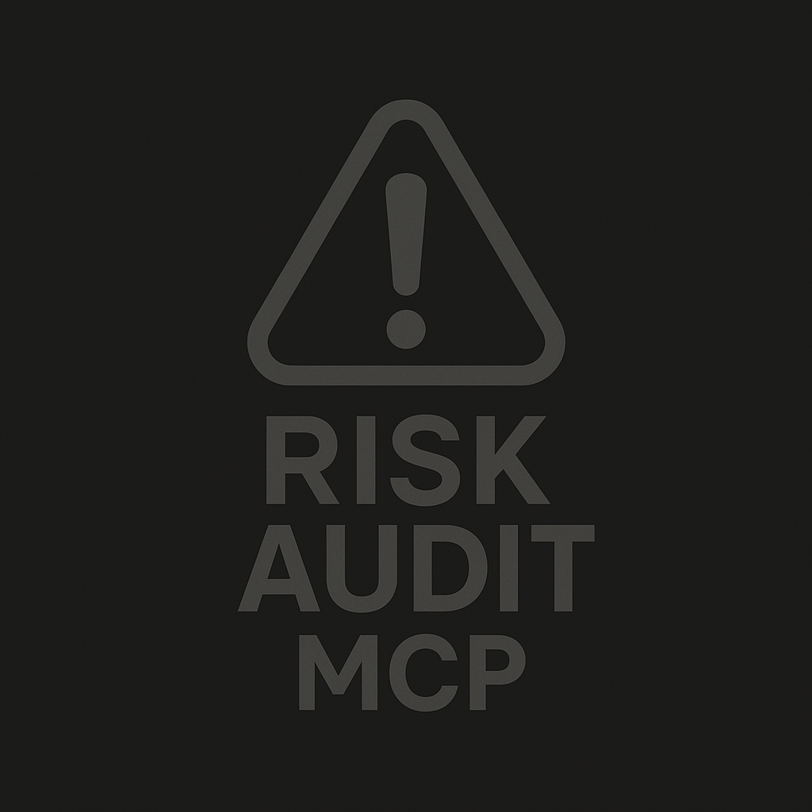

# Risk Audit MCP — Security Scanner

Risk Audit is a Model Context Protocol (MCP) server and CLI that scans your project for common security issues (XSS, injections, SSRF, path traversal, etc.). It runs locally, works offline, and gives clear, grouped results with suggested fixes.

## What is it?
- A tool that looks for risky patterns in your code and explains how to improve them.
- Works both as a CLI you can run in any repo and as an MCP server that IDE/AI tools can call.

## Who is it for?
- Beginners who want simple, actionable guidance to improve security.
- Developers who want a fast local scan they can wire into their workflow or MCP-enabled tools.

## Why use it?
- Quick feedback on common pitfalls (XSS, injections, SSRF, path traversal).
- Clear severity groups and practical fix suggestions.
- Zero network calls; your code never leaves your machine.

## Requirements
- Node.js >= 18

## Scripts
- `npm run dev` — run the TypeScript entrypoint via tsx (no build).
- `npm run build` — compile TypeScript to `dist/` via `tsc`.
- `npm start` — run the compiled output (`node dist/index.js`).
- `npm test` — build then run tests with Vitest.
- `npm run mcp` — start the MCP server (stdio).
- `npm run scan` — quick scan (unicode bars + emoji headers).

## Quick Start (Beginner‑friendly)

Install into any project:
- `npm install --save-dev risk-audit-mcp`

Run a quick scan (default style):
- `npx risk-audit-mcp`  (same as `npx risk-audit-mcp --quick`)

Use as an MCP server with Claude Desktop or Codex CLI:
- One‑line command (what the client runs): `risk-audit-mcp --mcp-stdio`

## Run MCP Server
- Start the MCP server with a simple command:
  - `npm run mcp`
  - Or use the binary directly if installed/linked: `risk-audit --mcp-stdio`
  - Or via npx without global install: `npx risk-audit --mcp-stdio`

## Client Setup Snippets

### Claude Desktop
One‑line command the app will run:

`risk-audit-mcp --mcp-stdio`

Where to put it (macOS): edit `~/Library/Application Support/Claude/claude_desktop_config.json` and add:
Edit `~/Library/Application Support/Claude/claude_desktop_config.json` and add:

{
  "mcpServers": {
    "risk-audit": {
      "command": "risk-audit-mcp",
      "args": ["--mcp-stdio"],
      "env": {}
    }
  }
}

Notes:
- Ensure `risk-audit` is on your PATH. If not, use:
  - `"command": "node", "args": ["/absolute/path/to/dist/index.js", "--mcp-stdio"]`

### Codex CLI
One‑line command the CLI will run:

`risk-audit-mcp --mcp-stdio`

How to register it in your Codex CLI config:
Register the MCP server so Codex can launch it over stdio. Example configuration entry:

{
  "mcpServers": {
    "risk-audit": {
      "command": "risk-audit-mcp",
      "args": ["--mcp-stdio"]
    }
  }
}

Notes:
- You can also point to Node directly if needed:
  - `"command": "node", "args": ["/absolute/path/to/dist/index.js", "--mcp-stdio"]`
- The server stays active until the client closes stdin.

## Understanding The Output
- Three groups by priority (with emoji in headers only):
  - ⚠️ Critical (fix immediately)
  - 🔍 Medium Priority
  - ⓘ Low Priority
- Each group has a progress bar and a numbered list of findings.
- File paths and line ranges are colored green so they stand out.
- Rule IDs are hidden by default in ASCII (show with `--show-ids`). JSON always includes `ruleId`.

## Output Format
- ASCII progress bars: `|==========......| 10/16 (62%)`
- Unicode bars: `[██████████░░░░░░] 10/16 (62%)` 

## Configuration (.vibecheckrc)
Place a `.vibecheckrc` (YAML) or `.vibecheckrc.json` at the project root.

Example YAML:

severityMin: medium
include: ["src/", "api/"]
exclude: ["dist/", "node_modules/"]
rules:
  disable: ["YAML001"]
  enable: []

- severityMin: filter out findings below this severity
- include/exclude: path substrings to include or exclude when scanning projects
- rules.enable/disable: whitelist/blacklist rule IDs

CLI respects config in project root for `--scan <dir>`. MCP `scan_project` also loads config from the given root.

## Security & Privacy
- All scanning runs locally; no code is uploaded anywhere.
- YAML rules are loaded from your repo’s `rules/` folder, if present. Be careful when adding third‑party rules to avoid regexes that cause slow scans (we cap matches per rule/file).
- We never execute your code; we only read files.

## Troubleshooting
- “command not found: risk-audit-mcp”
  - Use `npx risk-audit-mcp` or ensure npm’s global bin is on your PATH:
    - macOS/Linux: `echo $(npm bin -g)` then `export PATH="$(npm bin -g):$PATH"`
    - Or install locally: `npm i -D risk-audit-mcp` and run `npx risk-audit-mcp`
- MCP server shows only one line and “does nothing”
  - That’s expected: `risk-audit-mcp --mcp-stdio` waits for the client to connect via stdio.
  - Verify by adding it to Claude/Codex as shown above, or run a CLI scan instead.
- Claude Desktop doesn’t show the server
  - Double‑check the config path on macOS:
    `~/Library/Application Support/Claude/claude_desktop_config.json`
  - Make sure the entry uses this exact command: `risk-audit-mcp --mcp-stdio`
  - Restart Claude after editing the config.
- Codex CLI can’t start the server
  - Ensure your config registers:
    `command: "risk-audit-mcp"`, `args: ["--mcp-stdio"]`
  - Test in a terminal: `risk-audit-mcp --mcp-stdio` (should wait quietly)
- Unicode bars look weird
  - Use ASCII bars: add `--style ascii`
- Don’t like emoji
  - Use ASCII icons: add `--icons ascii`
- Want rule IDs visible in the ASCII report
  - Add `--show-ids` (JSON always includes `ruleId`).
- Scans feel slow on large repos
  - Limit scope: create `.vibecheckrc` with `include`/`exclude`, or run with `--scan src`.
  - Increase severity threshold: set `severityMin: medium` in `.vibecheckrc`.
